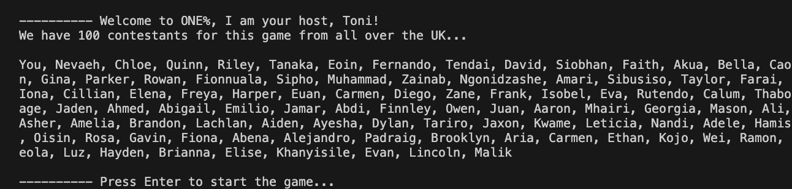
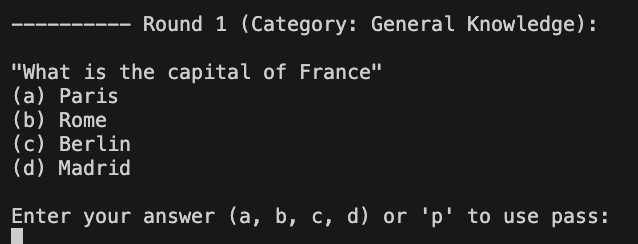
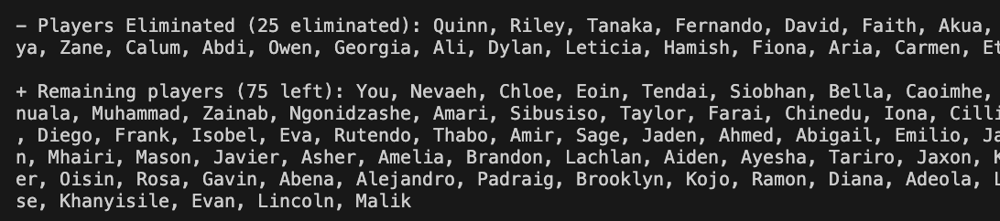
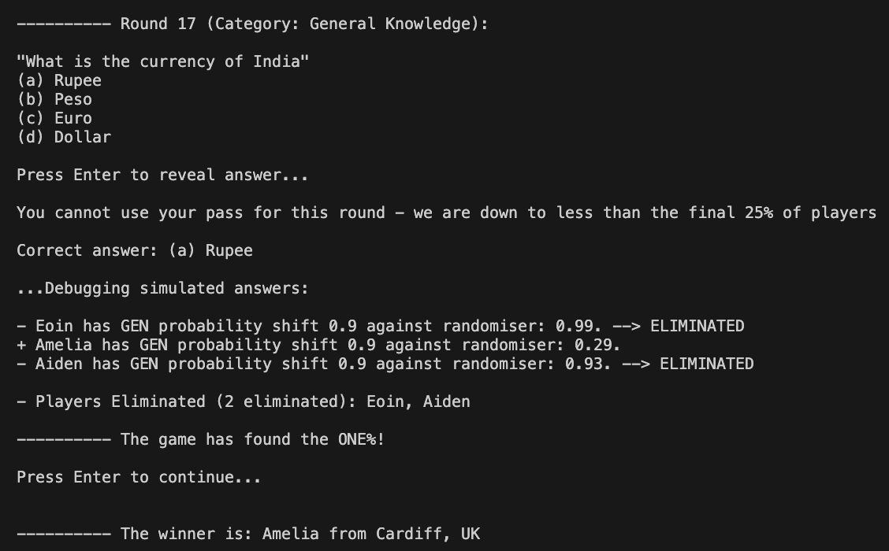

# ONE% Scala game-show

A Scala game-show program inspired by the ITV game-show, The 1% club. The game structure involves 100 players (the user called ‘You’ and 99 other ‘CPU’ players) who attempt to answer a question in each round.

Technology Stack: Scala

## Game structure:
* Rounds: (based on difficulty) 5, 10, 15, 25, 30, 45, 50, 60, 75, 80, 90, 99
* Each round: a question is given with a timer, the players must answer the question, whoever gets the answer correct, remains in the game; whoever gets the answer incorrect is eliminated from the game. The question per round increases in difficulty. The answer is then revealed and remaining players is updated (if at least someone got the answer correct, show the list of players in the round who get the answer incorrect and are eliminated)
    * 
* The following unique scenarios:
    ** All players get the answer incorrect: If all of the players in the current round get the question incorrect, then they are excused and another question is repeated.
    ** The user gets the answer incorrect: The user being ‘You’, gets the answer incorrect means they will be eliminated from the round, and will have to spectate the rest of the simulation of the game-show.
* Using a “Pass”: Each player has one “pass” they can use throughout the whole game, which will guarantee them into the next round, however it cannot be used if the game is reduced to the final 25 players.
* The end of the game: The remaining user who manages to stay in the game wins.

## Game data:
* Extracted from the CSV data of players and questions. 99 players randomly selected from the pool of players, and question selected per round e.g. a question of 10 difficulty, the next of 20 difficulty, the next of 30 difficulty, all up until a question of 99 difficulty etc.
* The players: randomly generated names with varied ratings which give their probability of doing well in the game-show; example format: “Thomas,68”
* The questions: the question, options, answer, category, difficulty (0-100 from easy to difficult); example format: “What is 1+1, ‘2;3;-1;4’, a, MAT, 10”

## Output screenshots:
Introduction to the game, the contestants of the game:  
Quiz question selected from particular category:  
(For debugging only) A breakdown of the probability simulator to determine of a CPU user passed the round:  
Eliminated and Remaining players: 
Conclusion to game, one contestant winner:  