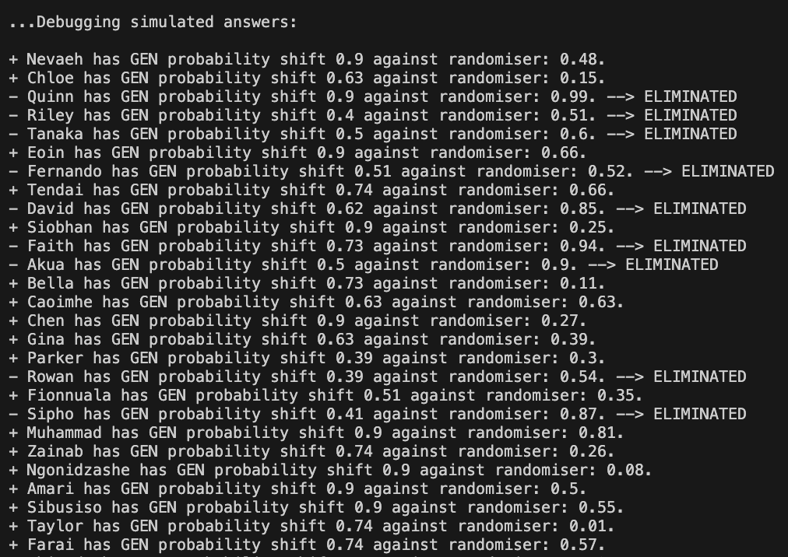

# ONE% Scala game-show

A Scala game-show program inspired by the ITV game-show, The 1% club. The game structure involves 100 players (the user called ‘You’ and 99 other ‘CPU’ players) who attempt to answer a question in each round.

Technology Stack: Scala

## Game structure:
* Rounds: (based on difficulty) 5, 10, 15, 25, 30, 45, 50, 60, 75, 80, 90, 99
* Each round: a question is given with a timer, the players must answer the question, whoever gets the answer correct, remains in the game; whoever gets the answer incorrect is eliminated from the game. The question per round increases in difficulty. The answer is then revealed and remaining players is updated (if at least someone got the answer correct, show the list of players in the round who get the answer incorrect and are eliminated)
    * 
* The following unique scenarios:
    ** All players get the answer incorrect: If all of the players in the current round get the question incorrect, then they are excused and another question is repeated.
    ** The user gets the answer incorrect: The user being ‘You’, gets the answer incorrect means they will be eliminated from the round, and will have to spectate the rest of the simulation of the game-show.
* Using a “Pass”: Each player has one “pass” they can use throughout the whole game, which will guarantee them into the next round, however it cannot be used if the game is reduced to the final 25 players.
* The end of the game: The remaining user who manages to stay in the game wins.

## Trivia Categories (with 3-digit CODE):
* (GEN) General Knowledge
* (SPO) Sports & Entertainment
* (MUS) Music & Arts
* (MAT) Mathematics & Geometry
* (LAN) Language & Literature
* (TEC) Technology & Science
* (GEO) Geography & Nature
* (HIS) History & Poltiics
* (REC) Religion & Culture

## Game data:
* Extracted from the CSV data of players, questions and categories. 99 players randomly selected from the pool of players, and question selected per round e.g. a question of 10 difficulty, the next of 20 difficulty, the next of 30 difficulty, all up until a question of 99 difficulty etc.
* The players: Contains information about players participating in the game-show. Each row represents a player with their name location, and ratings in different categories out of 100 (GEN, SPO, MUS, MAT, LAN, TEC, GEO, HIS, REC).
    * Example format: The header row is "name,location,GEN,SPO,MUS,MAT,LAN,TEC,GEO,HIS,REC"
    * Example player “Maria,London,75,23,32,94,28,12,31,82,91”. Maria's ability on general knowledge (75), sports & entertainment (23), music & arts (32), mathematics & geomatry (94), language & literature (28), technology & science (12), geography & nature (31), history politics (82), religion & culture (91)
* The questions: Holds the questions for the game-show. Each row represents a question with its options, correct answer category, and difficulty level. (0-100 from easy to difficult);
    * Example format: The header row is "question,options,answer,category,difficulty"
    * Example question: “What is 1+1, ‘2;3;-1;4’, a, MAT, 10”
* The categories: Provides a mapping between category codes and their corresponding names
    * Example format: The header row is "code,name"
    * Example category: "MAT,Mathematics & Geometry" The code for the category "Mathematics & Geometry"

## Output screenshots:
Introduction to the game, the contestants of the game:  
Quiz question selected from particular category:  
(For debugging only) A breakdown of the probability simulator to determine if a CPU contestant passed the round. Tthe outcome is based on their ability on the particular category and the difficulty of the question:  
Eliminated and Remaining players: 
Conclusion to game, one contestant winner:  